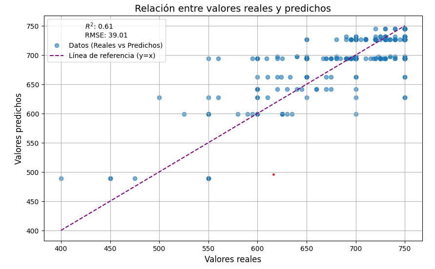

# Predicción Precio Alquileres Madrid


## Descripción del Proyecto
Este proyecto aborda el desafío de predecir precios de propiedades en Madrid, utilizando un conjunto de datos real con información sobre ubicación, tamaño, características y más. El objetivo es desarrollar un modelo predictivo preciso que ayude a agentes inmobiliarios, compradores y vendedores a tomar decisiones informadas en un mercado dinámico, transformando datos complejos en insights útiles.

## Instalación Entorno
Clonar repositorio y ejecutar el siguiente comando.
```bash
pip install -r requirements.txt
```

## Estructura Proyecto
```
Proyecto7-Prediccion_Precio_Casas_Madrid/
├── datos/
│   ├── datos_modelo1/          # Datos generados por y para el modelo 1 de Machine Learning.
│   ├── datos_modelo2/          # Datos generados por y para el modelo 2 de Machine Learning.
│
├── notebooks/
│   ├── Iteracion1/             # Primera iteración del análisis y modelado.
│   │   ├── 1_EDA.ipynb         # Análisis exploratorio de datos.
│   │   ├── 2_Estandarizacion.ipynb  # Estandarización de datos.
│   │   ├── 3_Encoding.ipynb    # Codificación de variables categóricas.
│   │   └── 4_Arbol_Decision.ipynb  # Modelo de Árbol de Decisión.
│   ├── Iteracion2/             # Segunda iteración del análisis y modelado.
│       ├── [Archivos de notebooks de la iteración 2 según corresponda]
│
├── pagina_web_interactiva/
│   └── main.py                 # Aplicación de StreamLit para probar el modelo.
│
├── src/
│   ├── assets/                 # Recursos adicionales (imágenes, GIFs, etc.).
│   │   └── demo_app.gif        # Animación de demostración de la aplicación.
│   ├── modelos/                # Modelos serializados.
│   │   ├── model_decision_tree_regressor.pkl  # Modelo de Árbol de Decisión serializado.
│   │   ├── robust_scaler.pkl                 # Escalador robusto para normalización.
│   │   └── target_encoder.pkl                # Codificador de variables categóricas.
│   ├── soporte_abtesting.py     # Scripts para pruebas A/B.
│   ├── soporte_combinatoria.py  # Scripts para generación de combinatorias.
│   ├── soporte_descriptiva.py   # Scripts para estadísticas descriptivas.
│   ├── soporte_encoding.py      # Scripts para codificación de variables.
│   ├── soporte_nulos.py         # Scripts para tratamiento de valores nulos.
│   ├── soporte_outliers.py      # Scripts para detección de outliers.
│   ├── soporte_preprocesamiento.py # Scripts generales de preprocesamiento.
│   └── soporte_regresion.py     # Scripts relacionados con modelos de regresión.
│
├── requirements.txt            # Dependencias del proyecto.
├── README.md                   # Documentación del proyecto.
└── .gitignore                  # Archivos y directorios ignorados por Git.

```

## Puntos a Remarcar
- Se han utilizado solo datos de las propiedades que tienen como provincia Madrid.

- En la apicación web pone que calcula precios de [2015 - 2018] debido que nuestros precios de base eran algo más bajos de los que hay en la actualidad, por lo que nuestras predicciones también. Investigando he visto que nuestras predicciones encajan más con los precios de los años mencionados.

## Conclución
Hemos creado un modelo de machine learning el cual es capaz de predecir el precio de un alquiler de Madrid con un RMSE de 39.01 €. Las predicciones sobre los datos de entrenamiento se logran ajustar con un 
r
2
 = 0.61, resultando en:




## Next Steps

- **Afinar más el modelo**: me gustaría hacer más pruebas y más visualizaciones para dejar más claro que factores están influyendo a la hora de predecir nuestra variable respuesta. Al final me propuse una serie de objetivos que he tratado de cubrir mediante un MVP.

- **Comprobación Final**: ya que sabemos utilizar Selenium, molaría que tras realizar la consulta para la predicción de un precio, se nos preguntara si queremos comparar los resultados y, con Selenium, buscaramos alquilires con los parametros que nos ha introducido el usuario para ver que
tan bien representa el modelo el precio de los alquileres en la actualidad.

- **Auto-Ajuste Inputs**: cuando el usuario seleccina municipio, distrito o vecindario, molaría que los demás inputs se empezaran a 'autocompletar' no mostrando por ejemplo, vecindarios que no pertenecen al municipio que esté selccionado. 

- **Mayor Limpieza**: mayor organización y limpieza en los notebooks además de la incorporación de indices al principio de estos.